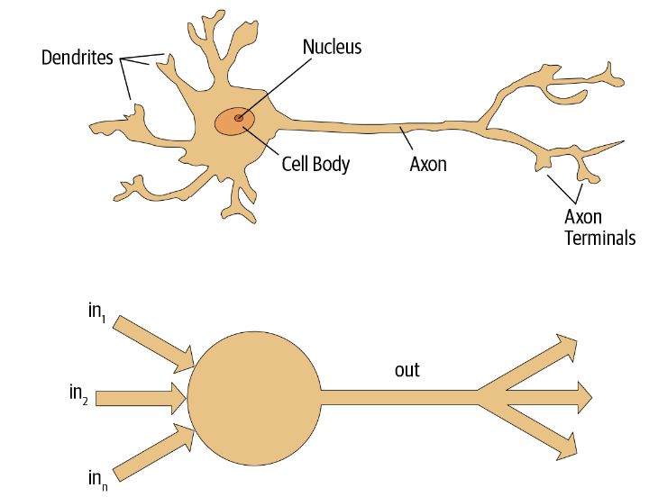

In today's blog we will look at the questionnaire from the first chapter of fast.ai book.

1. [Do you need maths, lots of data, expensive computers and a PhD for machine learning?](#q01)
2. [Name some areas where deep learning is now the best tool in the world.](#q02)
3. [What was the name of the first device that was based on the principle of the artificial neuron?](#q03)
4. [What are the requirements for parallel distributed processing (PDP)?](#q04)
5. [What were the two theoretical misunderstandings that held back the field of neural networks?](#q05)

## <a name="q01"/> Do you need maths, lots of data, expensive computers and a PhD for machine learning?

Deep Learning Is for Everyone.

- High school math is sufficient.
- We’ve seen record-breaking results with <50 items of data.
- You can get what you need for state-of-the-art work for free.

## <a name="q02"/> Name some areas where deep learning is now the best tool in the world.

### Natural language processing (NLP)

Answering questions; speech recognition; summarizing documents; classifying documents; finding names, dates, etc. in documents; searching for articles mentioning a concept

### Computer vision

Satellite and drone imagery interpretation (e.g., for disaster resilience), face recognition, image captioning, reading traffic signs, locating pedestrians and vehicles in autonomous vehicles

### Medicine

Finding anomalies in radiology images, including CT, MRI, and X-ray images; counting features in pathology slides; measuring features in ultrasounds; diagnosing diabetic retinopathy

### Biology

Folding proteins; classifying proteins; many genomics tasks, such as tumor-normal sequencing and classifying clinically actionable genetic mutations; cell classification; analyzing protein/protein interactions

### Image generation

Colorizing images, increasing image resolution, removing noise from images, converting images to art in the style of famous artists

### Recommendation systems

Web search, product recommendations, home page layout

### Playing games

Chess, Go, most Atari video games, and many real-time strategy games

### Robotics

Handling objects that are challenging to locate (e.g., transparent, shiny, lacking texture) or hard to pick up

### Other applications

Financial and logistical forecasting, text to speech.

## <a name="q03"/> What was the name of the first device that was based on the principle of the artificial neuron?

In 1943 Warren McCulloch, a neurophysiologist, and Walter Pitts, a logician, teamed up to develop a mathematical model of an artificial neuron. In their paper “A Logical Calculus of the Ideas Immanent in Nervous Activity,” they declared the following:

> Because of the “all-or-none” character of nervous activity, neural events and the relations among them can be treated by means of propositional logic. It is found that the behavior of every net can be described in these terms.

Rosenblatt further developed the artificial neuron to give it the ability to learn. Even more importantly, he worked on building the first device that used these principles, the Mark I Perceptron. In “The Design of an Intelligent Automaton,” Rosenblatt wrote about this work: “We are now about to witness the birth of such a machine—a machine capable of perceiving, recognizing and identifying its surroundings without any human training or control.” The perceptron was built and was able to successfully recognize simple shapes.

## <a name="q04"/> What are the requirements for parallel distributed processing (PDP)?

Perhaps the most pivotal work in neural networks in the last 50 years was the multi-volume Parallel Distributed Processing (PDP) by David Rumelhart, James McClelland, and the PDP Research Group, released in 1986 by MIT Press. Chapter 1 lays out a similar hope to that shown by Rosenblatt:

> People are smarter than today’s computers because the brain employs a basic computational architecture that is more suited to deal with a central aspect of the natural information processing tasks that people are so good at.…We will introduce a computational framework for modeling cognitive processes that seems…closer than other frameworks to the style of computation as it might be done by the brain.

The premise that PDP is using here is that traditional computer programs work very differently from brains, and that might be why computer programs had been (at that point) so bad at doing things that brains find easy (such as recognizing objects in pictures). The authors claimed that the PDP approach was “closer than other frameworks” to how the brain works, and therefore it might be better able to handle these kinds of tasks.

In fact, the approach laid out in PDP is very similar to the approach used in today’s neural networks. The book defined parallel distributed processing as requiring the following:

- A set of processing units

- A state of activation

- An output function for each unit

- A pattern of connectivity among units

- A propagation rule for propagating patterns of activities through the network of connectivities

- An activation rule for combining the inputs impinging on a unit with the current state of that unit to produce an output for the unit

- A learning rule whereby patterns of connectivity are modified by experience

- An environment within which the system must operate

Modern neural networks handle each of these requirements.

## <a name="q05"/> What were the two theoretical misunderstandings that held back the field of neural networks?

An MIT professor named Marvin Minsky (who was a grade behind Rosenblatt at the same high school!), along with Seymour Papert, wrote a book called Perceptrons (MIT Press) about Rosenblatt’s invention. They showed that a single layer of these devices was unable to learn some simple but critical mathematical functions (such as XOR). In the same book, they also showed that using multiple layers of the devices would allow these limitations to be addressed. Unfortunately, only the first of these insights was widely recognized. As a result, the global academic community nearly entirely gave up on neural networks for the next two decades.

## <a name="q06"/> What is a GPU?

A special kind of processor in your computer that can handle thousands of single tasks at the same time, especially designed for displaying 3D environments on a computer for playing games. These same basic tasks are very similar to what neural networks do, such that GPUs can run neural networks hundreds of times faster than regular CPUs. All modern computers contain a GPU, but few contain the right kind of GPU necessary for deep learning.
